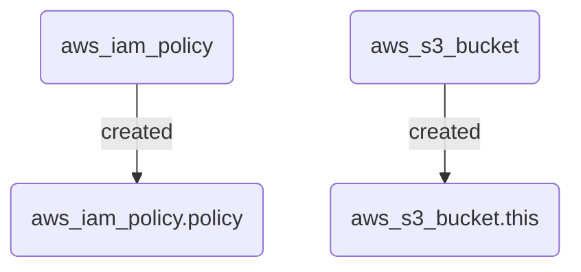

# Terramaid

<p align="center">

</p>

<p align="center">
  <em>A utility for creating Mermaid diagrams from Terraform plans</em>
</p>

## Installation

If you have a functional go environment, you can install with:

```sh
go install github.com/rosesecurity/terramaid/v1@latest
```

Build from source:

```sh
git clone git@github.com:RoseSecurity/terramaid.git
cd terramaid
make build
```

## Usage

1. We will generate a Terraform plan file, specifically `tf_plan_prod.json`:

```sh
terraform plan -out tf_plan_prod
```

2. After generating the plan file, we will convert it to JSON using Terraform show:

```sh
terraform show -json tf_plan_prod > tf_plan_prod.json
```

3. Once the JSON plan file has been created, run `terramaid` against it and look for the populated `Terramaid.md` file!

```sh
terramaid -planfile tf_plan_prod.json
```

```sh
cat Terramaid.md
```

Output:



## CI/CD Integration
