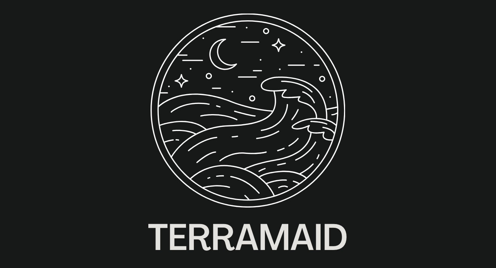
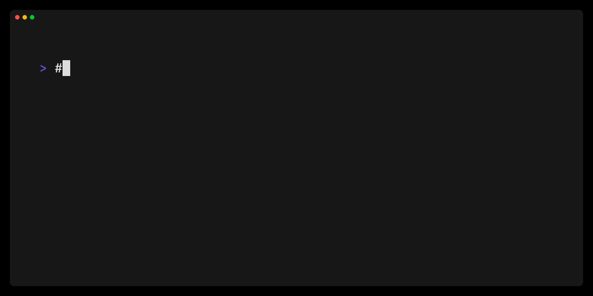
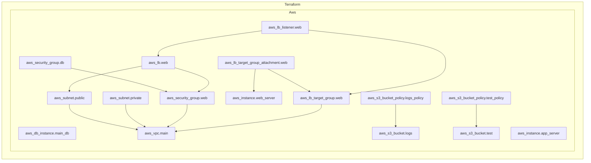

# Terramaid

<p align="center">

</p>

<p align="center">
  <em>A utility for creating Mermaid diagrams from Terraform configurations</em>
</p>

## Introduction

Terramaid transforms your Terraform resources and plans into visually appealing Mermaid diagrams. By converting complex infrastructure into easy-to-understand diagrams, Terramaid enhances documentation, simplifies review processes, and fosters better collaboration among team members. Whether you're looking to enrich your project's documentation, streamline reviews, or just bring a new level of clarity to your Terraform configurations, Terramaid is the perfect utility to integrate into your development workflow.

## Demo

<p align="center">

</p>

### Output



> [!TIP]
> ### You can try out `terramaid` directly in your browser using GitHub Codespaces
>
> [](https://github.com/codespaces/new?hide_repo_select=true&ref=main&repo=rosesecurity/terramaid&skip_quickstart=true)
>
>

## Installation

### Homebrew

```sh
brew install terramaid
```

If you have a functional Go environment, you can install with:

```sh
go install github.com/RoseSecurity/terramaid@latest
```

### Apt

To install packages, you can quickly setup the repository automatically:

```sh
curl -1sLf \
  'https://dl.cloudsmith.io/public/rosesecurity/terramaid/setup.deb.sh' \
  | sudo -E bash
```

Once the repository is configured, you can install with:

```sh
apt install terramaid=<VERSION>
```

### Source

```sh
git clone git@github.com:RoseSecurity/terramaid.git
cd terramaid
make build
```

### Usage

`terramaid` can be configured using CLI parameters and environment variables.

> [!NOTE]
> CLI parameters take precedence over environment variables.

The following configuration options are available:

```sh
> terramaid run -h
Generate Mermaid diagrams from Terraform configurations

Usage:
  terramaid run [flags]

Flags:
  -c, --chart-type string      Specify the type of Mermaid chart to generate (env: TERRAMAID_CHART_TYPE) (default "flowchart")
  -r, --direction string       Specify the direction of the diagram (env: TERRAMAID_DIRECTION) (default "TD")
  -h, --help                   help for run
  -o, --output string          Output file for Mermaid diagram (env: TERRAMAID_OUTPUT) (default "Terramaid.md")
  -s, --subgraph-name string   Specify the subgraph name of the diagram (env: TERRAMAID_SUBGRAPH_NAME) (default "Terraform")
  -b, --tf-binary string       Path to Terraform binary (env: TERRAMAID_TF_BINARY)
  -p, --tf-plan string         Path to Terraform plan file (env: TERRAMAID_TF_PLAN)
  -w, --working-dir string     Working directory for Terraform (env: TERRAMAID_WORKING_DIR) (default ".")

Use "terramaid [command] --help" for more information about a command.
```

### Docker Image

Run the following command to utilize the Terramaid Docker image:

```sh
docker run -it -v $(pwd):/usr/src/terramaid rosesecurity/terramaid:latest run
```

## CI/CD Integrations

Terramaid is designed to easily integrate with existing pipelines and workflows. For more information on sample GitHub Actions and GitLab CI/CD Pipelines, feel free to check out [GitHub Actions Integrations](./docs/GitHub_Actions_Integration.md) and [Gitlab Pipelines Integrations](./docs/GitLab_Pipelines_Integration.md).

## Contributing

For bug reports & feature requests, please use the [issue tracker](https://github.com/rosesecurity/terramaid/issues).

PRs are welcome! We follow the typical "fork-and-pull" Git workflow.
 1. **Fork** the repo on GitHub
 2. **Clone** the project to your own machine
 3. **Commit** changes to your own branch
 4. **Push** your work back up to your fork
 5. Submit a **Pull Request** so that we can review your changes

> [!TIP]
> Be sure to merge the latest changes from "upstream" before making a pull request!

### Many Thanks to Our Contributors

<a href="https://github.com/rosesecurity/terramaid/graphs/contributors">
  
</a>
