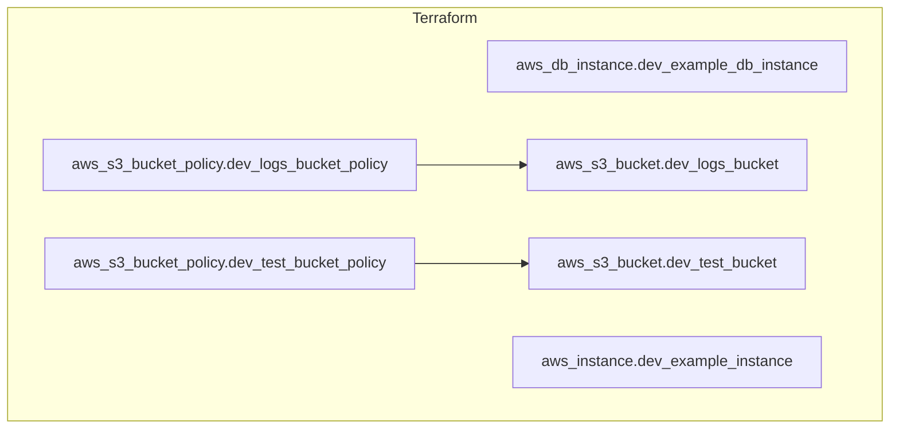
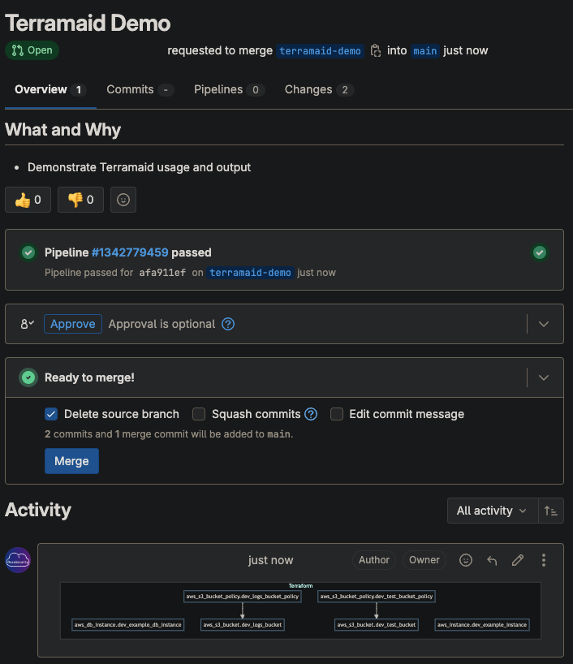

# Terramaid

<p align="center">

</p>

<p align="center">
  <em>A utility for creating Mermaid diagrams from Terraform plans</em>
</p>

[](https://pkg.go.dev/github.com/rosesecurity/terramaid)
[](https://opensource.org/licenses/Apache-2.0)
[](https://github.com/rosesecurity/terramaid/releases)

## Installation

If you have a functional go environment, you can install with:

```sh
go install github.com/rosesecurity/terramaid/v1@latest
```

Build from source:

```sh
git clone git@github.com:RoseSecurity/terramaid.git
cd terramaid
make build
```

## Usage

1. Run the program from the directory containing your Terraform: 

```sh
terramaid
```

> [!NOTE]
> If your Terraform binary is not located at `/usr/local/bin/terraform`, you will have to provide the path to the binary. For example, on Mac, this location could be: `/opt/homebrew/bin/terraform`

3. Look for the populated `Terramaid.md` file!

```sh
cat Terramaid.md
```

### Docker Image

Run the following command to utilize the Terramaid Docker image:

```sh
docker run -it -v $(pwd):/usr/src/terramaid rosesecurity/terramaid:latest
```

**Output File:**



**CI/CD Example:**

<p align="left">

</p>

## CI/CD Integration

An example GitHub Action:

```yaml
name: Terramaid

on:
  pull_request:
    paths:
      - '**/*.tf'

jobs:
  run-terraform-check:
    runs-on: ubuntu-latest

    steps:
    - name: Checkout repository
      uses: actions/checkout@v4

    - name: Set up Go
      uses: actions/setup-go@v4
      with:
        go-version: '1.22'

    - name: Download Go binary
      run: |
        curl -L -o /usr/local/bin/terramaid https://github.com/RoseSecurity/Terramaid/releases/download/v0.1.0/Terramaid_0.1.0_linux_amd64
        chmod +x /usr/local/bin/terramaid

    - name: Init
      run: terraform init

    - name: Terramaid
      id: terramaid
      run: |
        ./usr/local/bin/terramaid

    - name: Upload comment to PR
      uses: actions/github-script@v6
      with:
        script: |
          const fs = require('fs');
          const terramaid = fs.readFileSync('Terramaid.md', 'utf8');
          github.rest.issues.createComment({
            owner: context.repo.owner,
            repo: context.repo.repo,
            issue_number: context.issue.number,
            body: `## Terraform Plan\n\n${terramaid}`
          });
```
