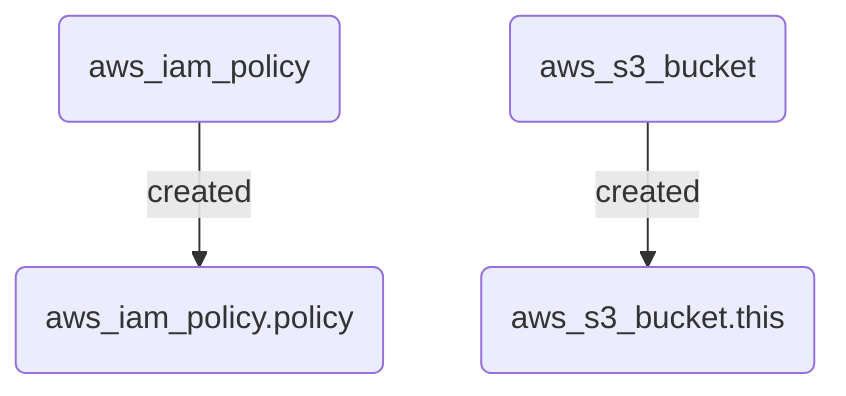

# Terramaid

<p align="center">

</p>

<p align="center">
  <em>A utility for creating Mermaid diagrams from Terraform plans</em>
</p>

## Installation

If you have a functional go environment, you can install with:

```sh
go install github.com/rosesecurity/terramaid/v1@latest
```

Build from source:

```sh
git clone git@github.com:RoseSecurity/terramaid.git
cd terramaid
make build
```

## Usage

1. We will generate a Terraform plan file, specifically `tf_plan_prod.json`:

```sh
terraform plan -out tf_plan_prod
```

2. After generating the plan file, we will convert it to JSON using Terraform show:

```sh
terraform show -json tf_plan_prod > tf_plan_prod.json
```

3. Once the JSON plan file has been created, run `terramaid` against it and look for the populated `Terramaid.md` file!

```sh
terramaid -planfile tf_plan_prod.json
```

```sh
cat Terramaid.md
```

### Docker Image

Run the following command to utilize the Terramaid Docker image:

```sh
docker run -it -v $(pwd):/usr/src/terramaid rosesecurity/terramaid:latest -planfile tfplan.json
```

**Output:**



## CI/CD Integration

An example GitHub Action:

```yaml
name: Terramaid

on:
  pull_request:
    paths:
      - '**/*.tf'

jobs:
  run-terraform-check:
    runs-on: ubuntu-latest

    steps:
    - name: Checkout repository
      uses: actions/checkout@v4

    - name: Set up Go
      uses: actions/setup-go@v4
      with:
        go-version: '1.22'

    - name: Download Go binary
      run: |
        curl -L -o /usr/local/bin/terramaid https://github.com/RoseSecurity/Terramaid/releases/download/v0.1.0/Terramaid_0.1.0_linux_amd64
        chmod +x /usr/local/bin/terramaid

    - name: Init
      run: terraform init

    - name: Plan
      run: terraform plan -out=tfplan

    - name: JSON Plan
      run: terraform show -json tfplan > tfplan.json

    - name: Terramaid
      id: terramaid
      run: |
        ./usr/local/bin/terramaid tfplan.json

    - name: Upload comment to PR
      uses: actions/github-script@v6
      with:
        script: |
          const fs = require('fs');
          const terramaid = fs.readFileSync('Terramaid.md', 'utf8');
          github.rest.issues.createComment({
            owner: context.repo.owner,
            repo: context.repo.repo,
            issue_number: context.issue.number,
            body: `## Terraform Plan\n\n${terramaid}`
          });
```
