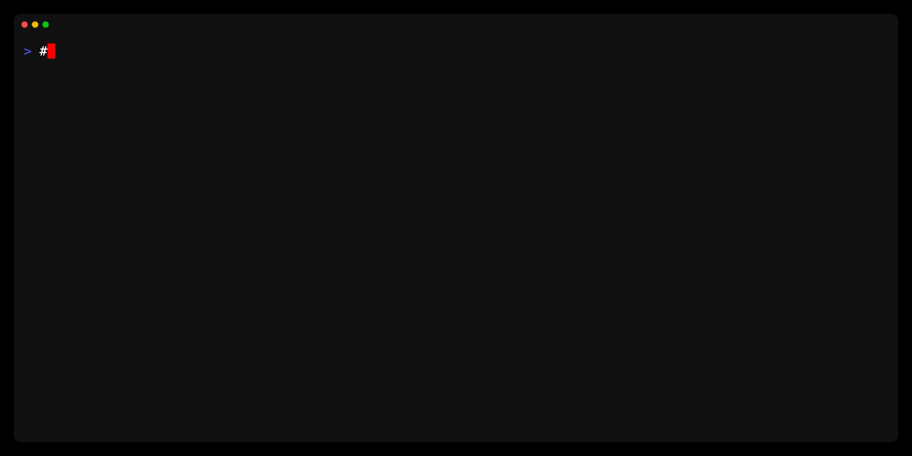

# Terramaid

  <em>A utility for creating Mermaid diagrams from Terraform configurations</em>

**Checkout the [Docs](https://rosesecurity.github.io/terramaid/) to learn more about `terramaid`**

## Introduction

Terramaid transforms your Terraform resources and plans into visually appealing Mermaid diagrams. By converting complex infrastructure into easy-to-understand diagrams, Terramaid enhances documentation, simplifies review processes, and fosters better collaboration among team members. Whether you're looking to enrich your project's documentation, streamline reviews, or just bring a new level of clarity to your Terraform configurations, Terramaid is the perfect utility to integrate into your development workflow.

## Demo

### Output

