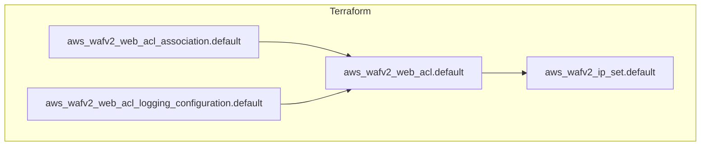

```mermaid
flowchart TD
    subgraph Terraform
        aws_wafv2_ip_set_default["aws_wafv2_ip_set.default"]
        aws_wafv2_web_acl_default["aws_wafv2_web_acl.default"]
        aws_wafv2_web_acl_association_default["aws_wafv2_web_acl_association.default"]
        aws_wafv2_web_acl_logging_configuration_default["aws_wafv2_web_acl_logging_configuration.default"]
    end
    aws_wafv2_web_acl_default --> aws_wafv2_ip_set_default
    aws_wafv2_web_acl_association_default --> aws_wafv2_web_acl_default
    aws_wafv2_web_acl_logging_configuration_default --> aws_wafv2_web_acl_default
```
