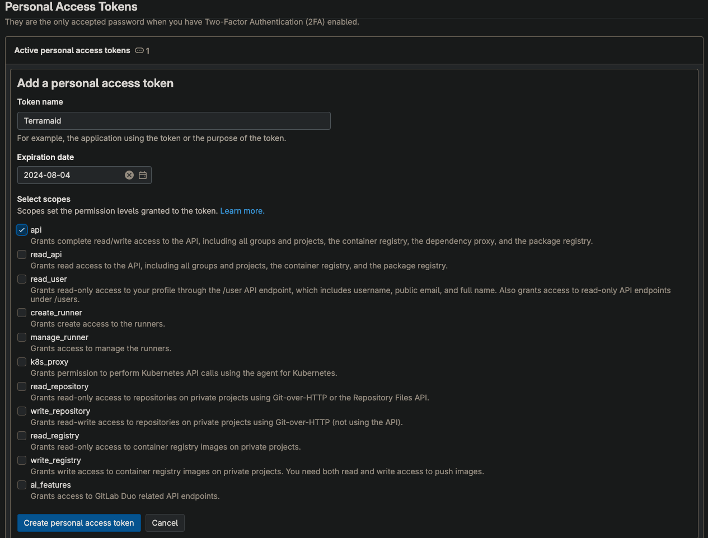
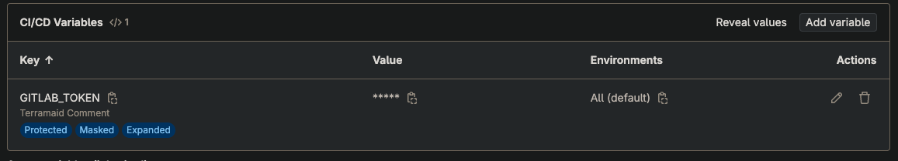
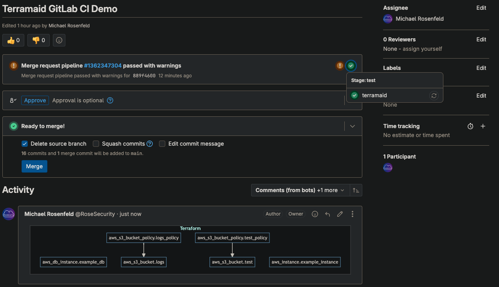

# GitLab Pipeline Integration

1. Create a GitLab Project Access Token with API access

> [!NOTE]
> Enter a relevant Token name
> Set an Expiration Date
> Select a Role (Reporter is probably the most relevant)
> Select the API checkbox

<p align="left">

</p>
1. Add the Access Token to GitLab's CI/CD variables or your vault provider

<p align="left">

</p>

2. Add the following stage to your pipelines:

```yaml
terramaid:
  image: docker:latest
  stage: test
  services:
    - docker:dind
  variables:
    DOCKER_HOST: tcp://docker:2375/
    DOCKER_DRIVER: overlay2
  rules:
    - if: $CI_COMMIT_BRANCH == $CI_DEFAULT_BRANCH
      when: never
    - if: '$CI_PIPELINE_SOURCE == "merge_request_event"'
      when: on_success
  script:
    - apk update && apk add curl jq
    - docker run -v $(pwd):/usr/src/terramaid run rosesecurity/terramaid:latest
    - |
      content=$(cat Terramaid.md)
      escaped_content=$(echo "$content" | jq -sRr @json)
      echo "Content read from Terramaid.md: $content"
      echo "GITLAB_TOKEN length: ${#GITLAB_TOKEN}"
      echo "Escaped content: $escaped_content"
      curl --verbose --location --request POST "https://gitlab.com/api/v4/projects/$CI_MERGE_REQUEST_PROJECT_ID/merge_requests/$CI_MERGE_REQUEST_IID/notes" \
      --header "PRIVATE-TOKEN: $GITLAB_TOKEN" \
      --header "Content-Type: application/json" \
      --data "{\"body\": $escaped_content}"
```

3. Utilize the pipeline and observe the output

<p align="left">

</p>
